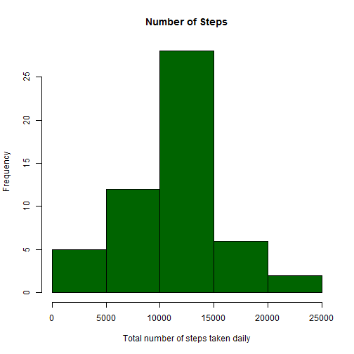
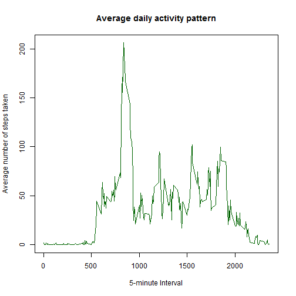
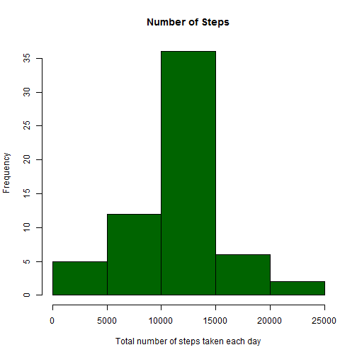
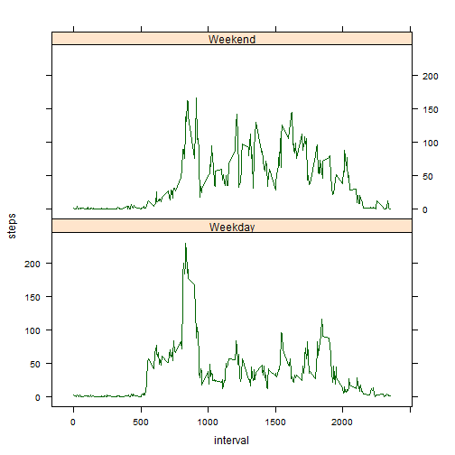

# Reproducible Research: Peer Assessment 1

## Loading and preprocessing the data

```r
## Load the activity data.
if (!file.exists("activity.csv"))
{
     if (!file.exists("activity.zip"))
          message("ERROR: Data file could not be found!")
     else
          unzip("activity.zip") # Unzips "activity.csv" file
}

inputData <- read.csv("activity.csv", header=TRUE)

## Process/transform the data into a format suitable for analysis.
cleanData <- inputData[which(inputData$steps != "NA"), ]
```

## What is mean total number of steps taken per day?

```r
library(plyr)

## Make a histogram of the total number of steps taken each day.
## Note: Ignore missing values in data set.
totalByDay <- ddply(cleanData, 
                    .(date), 
                    summarize, 
                    steps=sum(steps))

hist(totalByDay$steps, 
     main="Number of Steps", 
     xlab="Total number of steps taken daily", 
     col="dark green")
```

 

```r
## Calculate and report the mean and median total number of steps taken per day.
mean(totalByDay$steps)
```

```
## [1] 10766
```

```r
median(totalByDay$steps)
```

```
## [1] 10765
```

## What is the average daily activity pattern?

```r
## Make a time series plot (i.e. type = "l") of the 5-minute interval 
## (x-axis) and the average number of steps taken, averaged across 
## all days (y-axis).
averageStepsTakenByInterval <- ddply(cleanData, 
                                     .(interval), 
                                     summarize, 
                                     steps=mean(steps))

plot(averageStepsTakenByInterval$interval, 
     averageStepsTakenByInterval$steps, 
     type="l",
     col="dark green",
     xlab="5-minute Interval",
     ylab="Average number of steps taken",
     main="Average daily activity pattern")
```

 

```r
## Which 5-minute interval, on average across all the days in the dataset, 
## contains the maximum number of steps?
averageStepsTakenByInterval[averageStepsTakenByInterval$steps
                            ==max(averageStepsTakenByInterval$steps),]
```

```
##     interval steps
## 104      835 206.2
```

```r
colnames(averageStepsTakenByInterval)[2] <- "intervalAvg"
```

## Imputing (Inputing?) missing values

```r
## Note that there are a number of days/intervals where there are missing values 
## (coded as NA). The presence of missing days may introduce bias into some 
## calculations or summaries of the data.

## Calculate and report the total number of missing values in the dataset (i.e. the 
## total number of rows with NAs).
sum(is.na(inputData$steps))
```

```
## [1] 2304
```

```r
## Devise a strategy for filling in all of the missing values in the dataset. The 
## strategy does not need to be sophisticated. For example, you could use the 
## mean/median for that day, or the mean for that 5-minute interval, etc.
filledInData <- arrange(join(inputData, averageStepsTakenByInterval), interval)
```

```
## Joining by: interval
```

```r
## Create a new dataset that is equal to the original dataset but with the missing 
## data filled in.
filledInData$steps[is.na(filledInData$steps)] <- filledInData$intervalAvg[is.na(filledInData$steps)]

## Make a histogram of the total number of steps taken each day and Calculate and 
## report the mean and median total number of steps taken per day. Do these values 
## differ from the estimates from the first part of the assignment? What is the 
## impact of imputing missing data on the estimates of the total daily number of 
## steps?
newTotalByDay <- ddply(filledInData, 
                       .(date), 
                       summarize, 
                       steps=sum(steps))

hist(newTotalByDay$steps, 
     main="Number of Steps",
     xlab="Total number of steps taken each day", 
     col="dark green",)
```

 

```r
mean(newTotalByDay$steps)
```

```
## [1] 10766
```

```r
median(newTotalByDay$steps)
```

```
## [1] 10766
```

```r
totalStepsTakenPerDay1 <- sum(cleanData$steps)
totalStepsTakenPerkDay2 <- sum(filledInData$steps)
totalDifferenceBetweenStepsTakenPerDay <- totalStepsTakenPerkDay2 - totalStepsTakenPerDay1
```

*** The mean values didn't change because internal averages were used.

*** Both the historgram and the median changed a little bit.

*** Filling in all the missing values led to a total of 8.613 &times; 10<sup>4</sup> steps.

## Are there differences in activity patterns between weekdays and weekends?

```r
library(lattice)

## For this part the weekdays() function may be of some help here. Use the dataset 
## with the filled-in missing values for this part.

## Create a new factor variable in the dataset with two levels - "weekday" and 
## "weekend" indicating whether a given date is a weekday or weekend day.
weekdays <- weekdays(as.Date(filledInData$date))
weekdayData <- transform(filledInData, day=weekdays)
weekdayData$dayType <- ifelse(weekdayData$day %in% c("Saturday", "Sunday"), "Weekend", "Weekday")

## Make a panel plot containing a time series plot (i.e. type = "l") of the 
## 5-minute interval (x-axis) and the average number of steps taken, averaged 
## across all weekday days or weekend days (y-axis).
averageByIntervalDayType <- ddply(weekdayData, 
                                .(interval, dayType), 
                                summarize, 
                                steps=mean(steps))

xyplot(steps ~ interval | dayType, 
       data = averageByIntervalDayType, 
       layout = c(1, 2), 
       type="l",
       col="dark green")
```

 

*** Weekdays before 1000 are quite busy, while the rest of the day is fairly inactive.

*** Weekends have a smaller spike in activity before 1000, but the rest of the weekend days are considerably more active.

